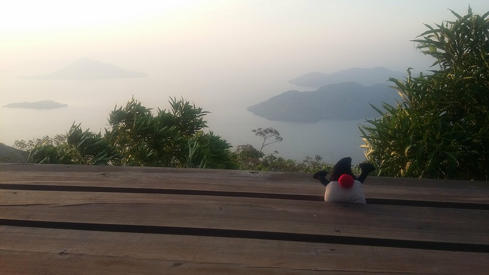
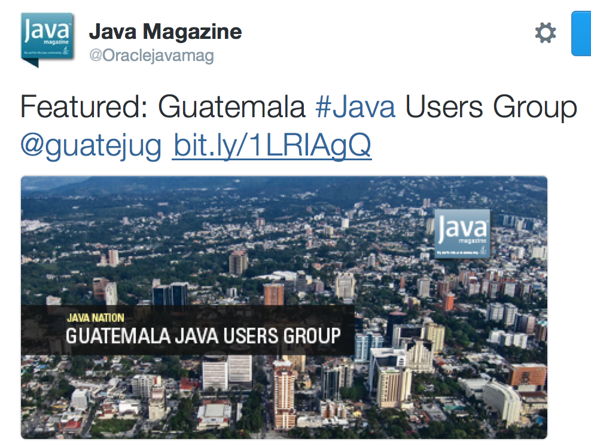
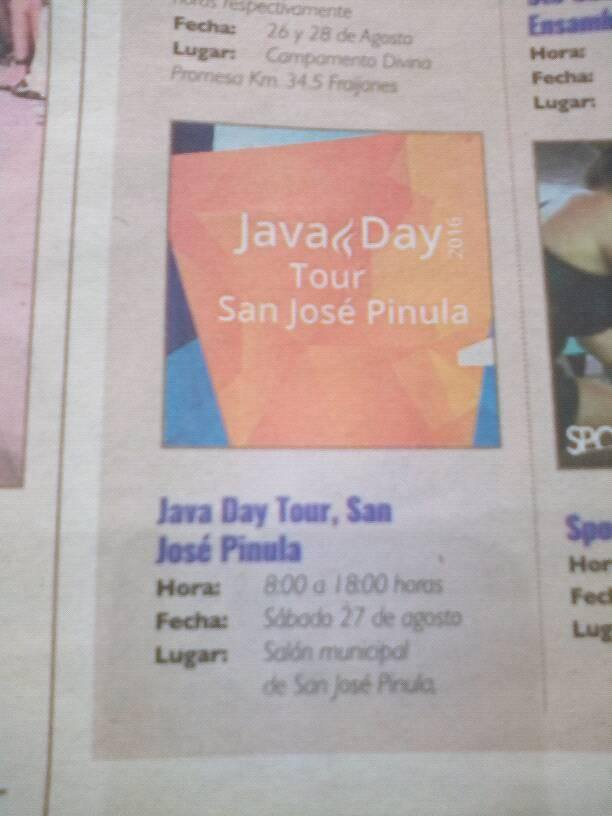
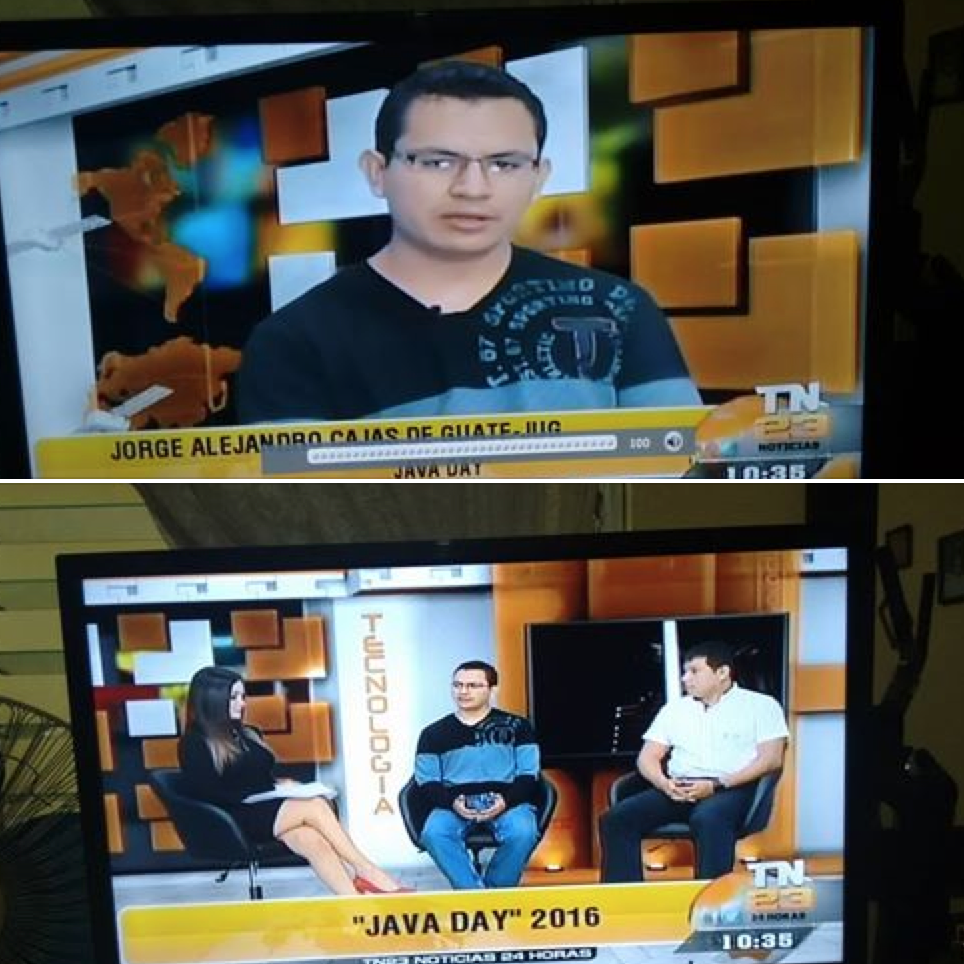

#Creating a foundation for your Java User Group

#Motivation
- 2005-2009: Advocate and later board member of my college Linux Users Group (pretty dead)
- 2009-2011: "Well known buddy" of a wide-country Free Software Association (mostly dead)
- 2009-2009: Participant in the first Java User Group in .gt (yup dead too) 

#Conclusion
Maybe I'm the worst leader of IT history . . . 

#Motivation
- Board member and recently JUG Leader of the Guatemala Java Users Group

By far the strongest User Group at our country, and (probably) the biggest Java User Group in Central America

#TL:DR
We(I) created user groups for the leaders, not for the members. A group is good only if it's good for the (potential and actual) members.

#Lesson 1: Don't be a hero
- 5 members: Every member is also a leader
- 10 members: Every member wanna be a leader
- 50 members: Every member hates the leader since it thinks he/she would be a better leader 
- **Start horizontal ASAP**

#Lesson 2: Mighty Morphin core members
- Identify your JUG style (not everyone is confortable with an isolated leader, most people is probably confortable with a core team)
- Identify your leaders (hint: people that likes technology over recognition)
- Eventually the leadership will rotate, this is GOOD, just do it
- **Embrace the team, promote new members in "administrative tasks"**

#Lesson 3: Res publica non dominetur
- Good JUGs are created by and for the people
- People = developers, local universities, other user groups, sponsors (in that order)
- Embrace the environment, people is using Java 5 and Java 8
- **Ask for interests in each meeting, every early adopter is a potential speaker**

#Lesson 4: Create value for everyone, not for you
- (Most) Human beings are selfish
- Eventually you'll notice biases in activities, that's perfect
- As you grow ask for sponsorship, people love freebies
- Valuable = Jobs, technical discussions, face to face meetings, study groups, tech talks, hands on labs, conferences, networking
- Non valuable = SPAM, self promotion, isolated members promotion, flamewars
- *Non valuable things are the poison of user groups**

#Lesson 5: Traditions
- Maturity = When you have enough active people to start projects
- Meetings at regular basis on regular days (It's easy to remember)
- Identify what works for you -e.g. guatemalans hate Google+, love Facebook, hate Meetup, love mailing lists, hate forums, love twitter-
- Explain traditions to newcomers
- **Not everything is code**

#Lesson 6: Have fun
- Recognition isn't the only objective, but SHARE IT since day 0
- Conferences, JSR, talks, are a consequence of good vibe, not a cause
- Maybe one day you simply took your Duke plush to hike volcanoes with your peers

- Other day your group could be featured at Java Magazine

- Or maybe on a nation wide newspaper

- Other day the kid that started with Java at your conferece would be featured on national TV

- Or maybe your talk is accepted at Java One, who knows :)

